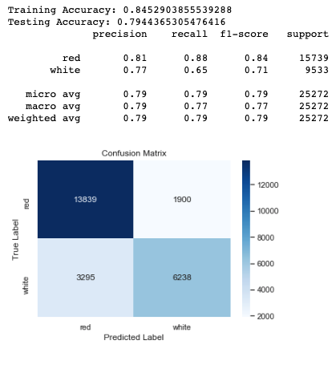
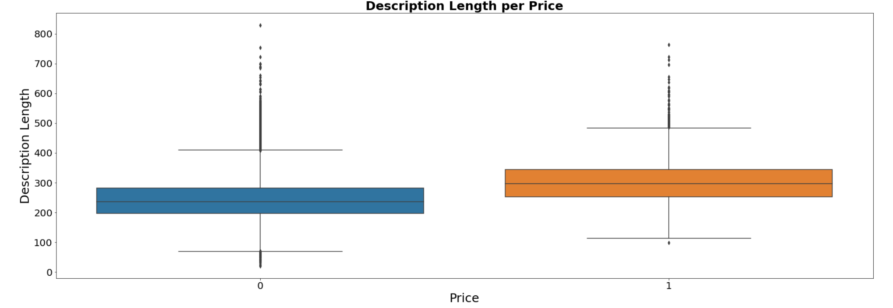

# Goals

Our goal is to create classification models using a [collection of wine reviews](https://www.kaggle.com/zynicide/wine-reviews) on Kaggle, originally from Wine Enthusiast.

Lindsey will be creating an a classification model that attempts to discern whether a wine is white or red.

Harrison will be seeing if he can predict the score or price of the wine based on the length of the review, using a classification model after creating score and price categories. 

# Results

Lindsey iterated through many different types of [classification models](https://github.com/lindseyberlin/Mod5Project/blob/master/Lindsey_ModelSelection.ipynb), to arrive at an [XGBoosted model](https://github.com/lindseyberlin/Mod5Project/blob/master/Lindsey_FinalModel.ipynb) which was able to predict whether a wine was white or red with 80% accuracy on the test data.

Harrison [found](https://github.com/lindseyberlin/Mod5Project/blob/master/Harrison_Final.ipynb) that review length as a predictor of point value was not much better than random chance, but review length was a much better predictor of a wine's price - but only for wines under $100! For wines above $100, the review length was not a good predictor of price. 

Harrison also worked through a supplemental dataset on wine composition to see the effects of the random forest classifier in a different context.
